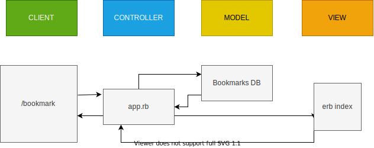

### User Stories

```
As a user,
So that I can remember the sites I want to go back to,
I'd like to see a list of sites I have bookmarked.
```
### Domain Modeling




### Setting up the database

- Connect to `psql` and create the `bookmark_manager` and `bookmark_manager_test` databases.
- `CREATE DATABASE bookmark_manager;`
- `CREATE DATABASE bookmark_manager_test;`
- Use `\c bookmark_manager` to connect to the database;
- Enter the query inside db/migrations;
- Run `\q` to exit postgresql.

The website will have the following specification:
```
Show a list of bookmarks
Add new bookmarks
Delete bookmarks
Update bookmarks
Comment on bookmarks
Tag bookmarks into categories
Filter bookmarks by tag
Users are restricted to manage only their own bookmarks
```
